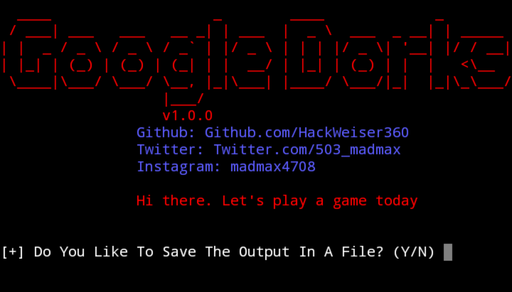

## GoogleDorks

GoogleDorks collects potentially vulnerable web pages and applications on the Internet or other awesome info that is picked up by Google's search bots. 

You can save the output in a file so that you can view it at a later time. You can determine the number of searches yourself and also the number of websites to display

You can also use GoogleDorks as a command-line interface (CLI) to quickly search through Google. GoogleDorks shows only the links, without advertising, and is and is also fast.

But be careful not to overdo it. Otherwise you have a chance that if you perform too many requests over a short period, Google will start to throw captchas at you. This is annoying and will limit how much or how fast you do the search.

## Data you can find using GoogleDorks
1. Username and passwords
2. Admin login pages
3. Sensitive documents
4. Govt/military data
5. Email lists
6. Bank account details
7. Vulnerable websites

and other cool stuff too.
***
## Install GoogleDorks
GoogleDorks can be installed in:
* Kali Linux
* Parrot 
* BlackArch
* Termux

****
# [√] Installation and Usage on Linux
* $ sudo git clone https://github.com/HackWeiser360/GoogleDorks
* $ cd GoogleDorks
* $ pip3 install -r requirements.txt
* $ sudo python3 GoogleDorks.py
****
# [√] Installation and Usage on Termux
* $ git clone https://github.com/HackWeiser360/GoogleDorks
* $ cd GoogleDorks
* $ pip install -r requirements.txt
* $ python GoogleDorks.py
****
## DISCLAIMER:
### 1. THIS TOOL WAS MADE FOR EDUCATIONAL PURPOSES AND PENETRATION TESTING ONLY!
### 2. THE AUTHOR WON'T BE RESPONSIBLE FOR ANY HARM OR DAMAGE CAUSES BY THIS TOOL.
### 3. DON'T USE THE INFORMATION YOU GET FROM THIS TOOL TO GAIN UNAUTHORIZED ACCESS.
### 4. PERFORMING ANY HACK WITHOUT WRITTEN INFORMATION IS ILLEGAL.
***

## Follow on Social Media

<a href="https://www.instagram.com/madmax4708/" target="_blank">

### Stargazers
